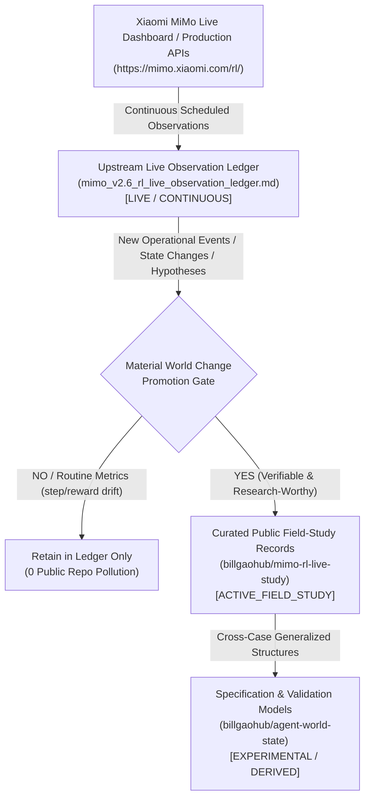

# MiMo RL Live Study: Empirical Verification of Decoupled Grader Architecture & Operational Incidents

[](https://opensource.org/licenses/MIT)
[](https://creativecommons.org/licenses/by/4.0/)
[](#bounded-scope)
[](#three-tier-authority-architecture--ingestion-pipeline)
[](#field-study-lifecycle--promotion-protocol)

This repository provides an empirical, verifiable field study analyzing distributed reinforcement learning (RL) training operations, focusing on the **Xiaomi MiMo-V2.6 large-scale agentic RL system**.

It examines architectural decoupling, verification failure domains, and temporal observability integrity across two audited events during the September 2026 live run.

---

## Bounded Scope

This repository is strictly bounded to **two physical events** audited under the BillGaoHub empirical governance framework:

1. **Event A (`OBS-MIMO-002`)**: The architectural formulation of **Grader Compute** as an independent scaling axis.
2. **Event B (`OBS-MIMO-005`)**: A production **Grader Deployment Network Partition and Cluster Run Restart** incident.

> [!NOTE]
> This study does **not** claim to reconstruct the entire MiMo-V2.6 training run or internal datacenter topology. Claims are restricted strictly to verifiable empirical observations and explicit public statements.

---

## Three-Tier Authority Architecture & Ingestion Pipeline

To prevent epistemic conflation and maintain rigorous traceability, authority and data ingestion are structured into three non-overlapping tiers:



| Layer | Component | Epistemic Role | Operational Lifecycle |
|---|---|---|---|
| **1. Source Authority** | Xiaomi MiMo Production APIs | Origin factual reality (live status, notices, rollouts) | `PRIMARY_ORIGIN` |
| **2. Continuous Observation** | `mimo_v2.6_rl_live_observation_ledger.md` | Continuous tracking, raw snapshots, timing metrics, anomaly signals, candidate hypotheses | `LIVE / CONTINUOUS` |
| **3. Public Research Projection** | `billgaohub/mimo-rl-live-study` (This Repo) | Verified, desensitized, citable field-study records (`OBS-MIMO-00X`) of material events | `ACTIVE_FIELD_STUDY` |
| **4. Derived Specification** | `billgaohub/agent-world-state` | Generalized cross-study schemas, temporal integrity rules, and state decay dynamics | `EXPERIMENTAL / DERIVED` |

---

## Field Study Lifecycle & Promotion Protocol

### 1. The Ledger → Public Study Promotion Gate
`scheduled ledger update != public repo update`. Routine telemetry steps (e.g. step $321 \rightarrow 326$, reward $0.710 \rightarrow 0.712$, normal linear GPU compute burn) remain strictly in the local observation ledger to prevent noise pollution.

A world change is promoted to this public repository as an audited observation (`OBS-MIMO-00X`) only when all three criteria are met:
1. **Materiality**: It represents a significant operational state change:
   - Training run restarts, cluster crashes, or recovery checkpoints
   - Decoupled Grader or GPU training cluster network partitions/outages
   - Online dataset additions, removals, or policy rollbacks
   - Official operator notices providing architectural explanations
   - Discovery of primary first-party links for currently `SECONDARY_CORROBORATED` claims
   - Direct contradiction of an existing claim by new empirical evidence
   - Observation of new temporal/clock divergence phenomena
   - Formal conclusion of the live training run
2. **Verifiability**: It is backed by reproducible physical API payloads or corroborating multi-source traces.
3. **Research Value**: It provides enduring insight into distributed multi-agent RL architecture, verification failure domains, or telemetry observability.

### 2. Lifecycle & Completion Criteria
- **Observation Ledger Status**: `CONTINUOUSLY_UPDATED` (Tracking live training run).
- **Public Field Study Status**: `ACTIVE_FIELD_STUDY` (Initial slice v0.1: Bounded 2 calibrated events).
- **Coverage Status**: `PARTIAL / EXPANDING` (Focused on decoupled verification and failure domains).
- **Study Completion Gate**:
  $$\text{LIVE\_RUN\_ENDED} + \text{FINAL\_STATE\_CAPTURED} + \text{MATERIAL\_EVENTS\_ADJUDICATED} + \text{POST\_RUN\_SYNTHESIS\_COMPLETE}$$
  When the live run formally concludes and the final state is captured in the upstream ledger, a comprehensive post-run synthesis will transition this repository:
  $$\text{ACTIVE\_FIELD\_STUDY} \longrightarrow \text{RUN\_COMPLETED\_PENDING\_SYNTHESIS} \longrightarrow \text{STUDY\_COMPLETE}$$

---

## Core Epistemic Adjudications

### 1. Event A: Grader Compute Scaling Axis (`OBS-MIMO-002`)
- **Status**: `SECONDARY_CORROBORATED` (Downgraded from prior uncalibrated claims).
- **Adjudication**: While 5 independent tech media outlets reported statements by Xiaomi MiMo Technical Lead Luo Fuli defining Grader Compute as the 3rd scaling axis (alongside Compute and Environments/Harnesses), no immutable primary permalink (direct personal post or formal whitepaper) was pinned in sandbox. In adherence to strict epistemic standards, this claim is maintained as secondary corroboration, not primary verified.

### 2. Event B: Decoupled Grader Failure & Restart (`OBS-MIMO-005`)
- **Status**: `PHYSICAL_API_VERIFIED` (Observed single instance only).
- **Adjudication**: Direct retrieval from production endpoint `https://mimo.xiaomi.com/rl/api/notices` (Notice ID `n-15ac72`) confirmed a network connectivity issue between the Pro training cluster and the grader deployment, triggering an operational run restart. Subsequent status streams confirmed Pro step 15 recovery at 08:09:48 PDT.
- **Bound**: `observed instance != universal architecture rule`. This incident confirms that verification infrastructure *can* be deployed as an independent service and distinct failure domain, but does not mandate universal architectural dictates for all RL platforms.

### 3. Temporal Integrity: Observer / Dashboard Divergence
- **Discrepancy**: A delta of **11 hours, 39 minutes, 54 seconds** was identified between the top-level UI status bar header (17:00:05 PDT) and the underlying notice publication epoch (`1789647611.047444` $\rightarrow$ 05:20:11 PDT).
- **Epistemic Principle**: This is classified as **observer/dashboard timestamp divergence**, enforcing the separation:
  $$\text{source\_event\_timestamp} \neq \text{dashboard\_clock\_timestamp} \neq \text{collector\_timestamp}$$
  The UI header represented the dashboard snapshot time, whereas the underlying event occurred 11h 40m prior, preceding and explaining the physical restarts at 02:29 PDT and 04:21 PDT.

---

## Repository Structure

```text
mimo-rl-live-study/
├── README.md                           # Master field study specification
├── SOURCE_CONTRACT.md                  # Epistemic axes, negative gates & sources
├── LICENSE                             # Dual MIT / CC BY 4.0 License
├── evidence-map.yaml                   # Abstract payload locators & cryptographic hashes
├── events/
│   ├── OBS-MIMO-002.yaml              # Event A: Grader Compute Scaling Axis
│   └── OBS-MIMO-005.yaml              # Event B: Grader Network Partition & Restart
├── temporal/
│   └── timestamp-integrity.md         # Detailed 3-timestamp divergence audit
├── claims/
│   └── claims.yaml                    # Propositional claims & verification states
├── corrections/
│   └── corrections.yaml               # 5 formal epistemic and methodological corrections
└── analysis/
    └── derived-analysis.md            # Bounded architectural implications
```

---

## Verification & Integrity

All structured YAML files in this repository conform to deterministically validated schemas. Payloads referenced in `evidence-map.yaml` are pinned via SHA-256 digests. Raw API dumps containing potentially ephemeral session data are excluded in accordance with privacy and repository cleanliness standards.

---

## License

- **Code & Tooling**: [MIT License](LICENSE#1-code--software-scripts-mit-license)
- **Documentation & Structured Records**: [Creative Commons Attribution 4.0 International (CC BY 4.0)](LICENSE#2-research-documentation-curated-datasets--structured-yaml-records-cc-by-40)
- **Third-Party Rights**: All referenced trademarks and third-party quotes belong to their respective rights holders.
